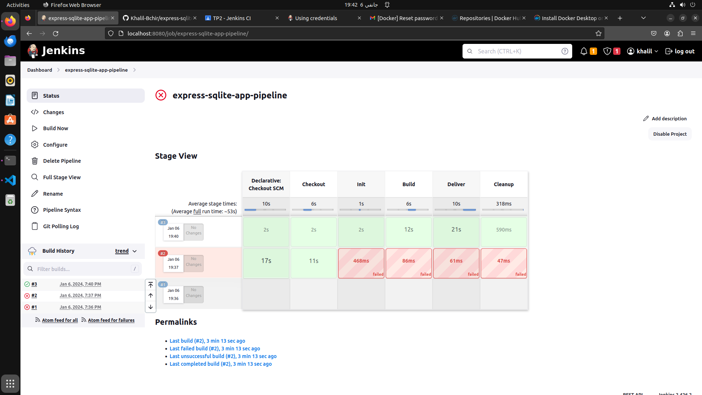
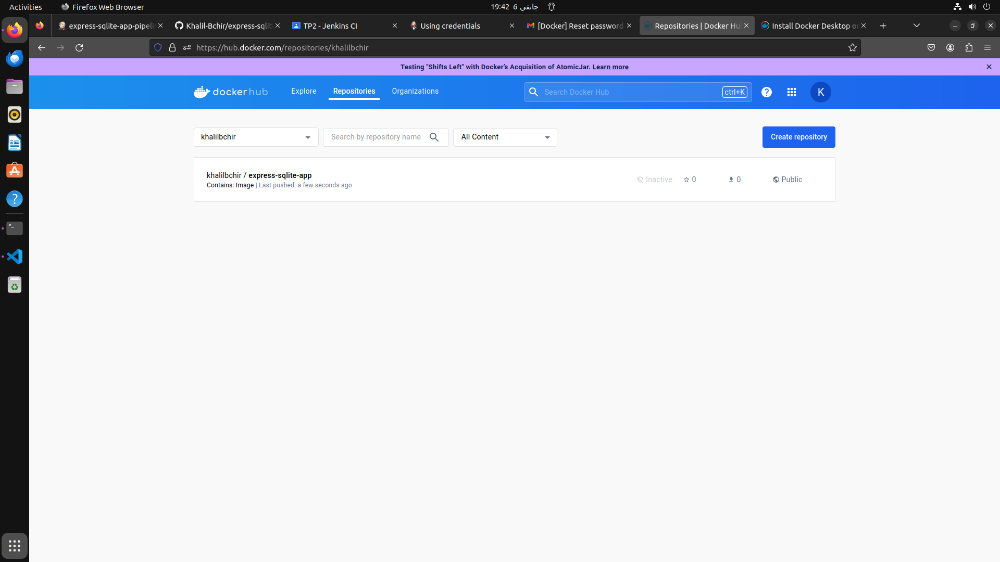
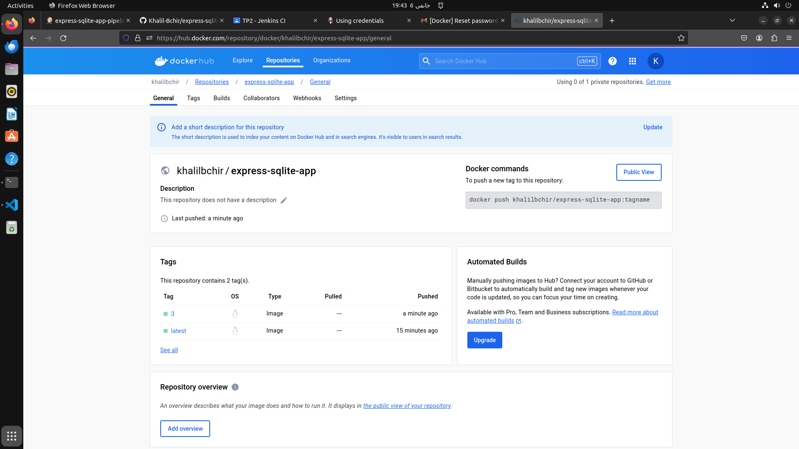

# express-sqlite

## Description
This project demonstrates the process of creating, containerizing, and deploying an Express.js application with SQLite using Docker and Docker Compose. Additionally, it includes an automated CI/CD pipeline using Jenkins for image creation and delivery.

## Table of Contents
1. [GitLab Configuration](#gitlab-configuration)
2. [Express.js Application](#expressjs-application)
3. [Docker Image Creation](#docker-image-creation)
4. [Docker Compose](#docker-compose)
5. [Jenkins CI/CD Pipeline](#jenkins-cicd-pipeline)
6. [Screenshots](#screenshots)

## GitLab Configuration
1. Create a project on GitLab (or GitHub) named "express-sqlite."
2. Clone the project to your local machine.
3. Optionally, configure a GitFlow workflow for the project using your preferred tool.

## Express.js Application
1. Navigate to the project directory: `cd express-sqlite`
2. Initialize a Node.js project: `npm init`
3. Install dependencies: `npm install express sqlite3`
4. Create an `app.js` file with the provided Express.js code.
5. Test the application using Postman.

## Docker Image Creation
1. Create a `Dockerfile` in the project's root directory:

    ```dockerfile
    FROM node:lts-alpine
    WORKDIR /usr/src/app
    COPY package*.json ./
    COPY app.js ./
    RUN npm install
    EXPOSE 3000
    CMD ["node", "app.js"]
    ```

2. Build the Docker image:

    ```bash
    docker build -t <username>/express-sqlite-app .
    ```

3. Test the Docker image locally:

    ```bash
    docker run -p 3000:3000 <username>/express-sqlite-app
    ```

4. Connect to DockerHub and publish the Docker image:

    ```bash
    docker push <username>/express-sqlite-app
    ```

## Docker Compose
1. Create a `docker-compose.yml` file:

    ```yaml
    version: '3'
    services:
      app:
        image: <username>/express-sqlite-app
        container_name: express-sqlite-app
        volumes:
          - ./mydatabase.db:/usr/src/app/mydatabase.db
        ports:
          - "3000:3000"
    ```

2. Run the application using Docker Compose:

    ```bash
    docker-compose up
    ```

## Jenkins CI/CD Pipeline
1. Add your DockerHub login to Jenkins as described [here](https://www.jenkins.io/doc/book/using/using-credentials/). Ensure your login has the ID: `dh_cred`.
2. Create a `Jenkinsfile` at the project root with the provided content.
3. Commit and push changes and verify the pipeline execution in Jenkins.

## Screenshots
1. **Jenkins Pipeline Dashboard:**
   

2. **DockerHub Repository with Published Image:**
   
   

